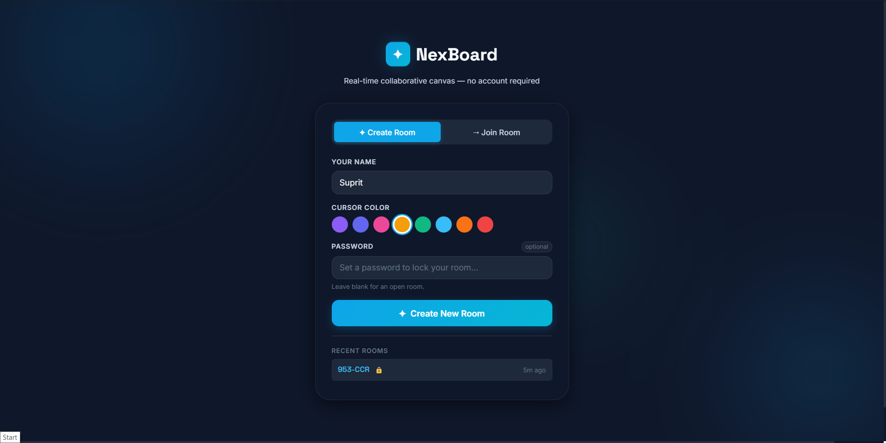
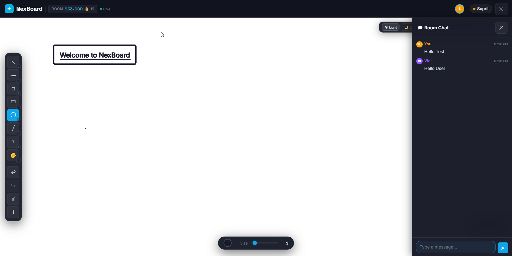
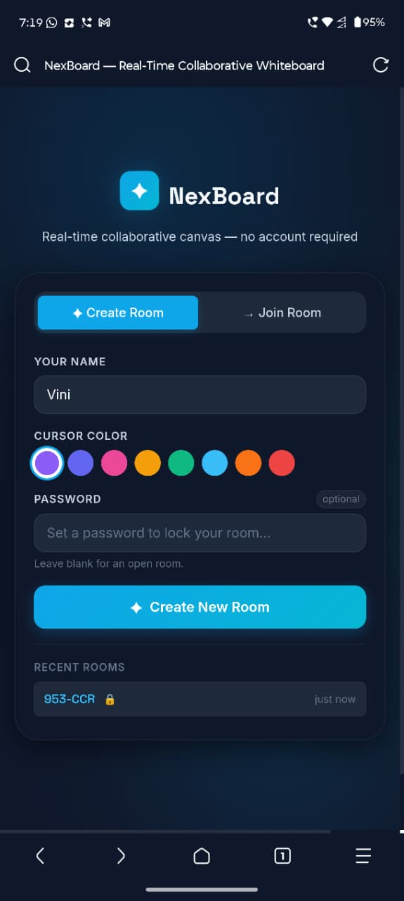
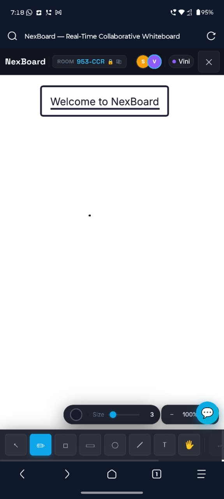
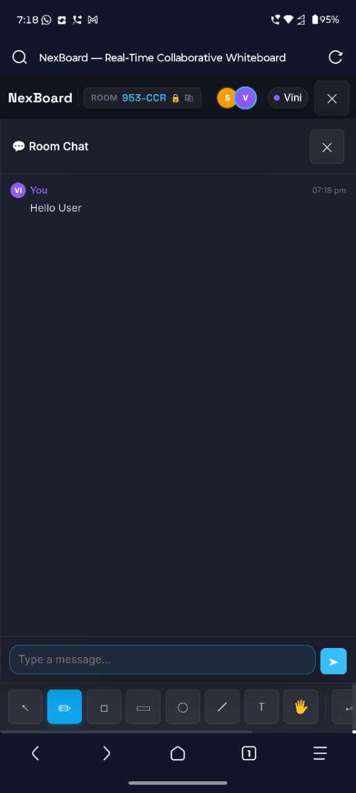

<h1 align="center">✦ NexBoard — Real-Time Collaborative Whiteboard</h1>

<p align="center">
  <strong>A fully featured, real-time collaborative whiteboard! This project allows multiple users to draw, chat, and interact simultaneously on the same infinite canvas.</strong>
</p>

<p align="center">
  
</p>

---

## 🎨 Visual Showcase & Features

NexBoard is designed to be incredibly fast, simple to use, and beautiful across all devices. No account is required—just enter a room code, share it with your team, and start collaborating instantly.

### 💻 Desktop Experience
The desktop interface provides a massive infinite canvas with a sleek, dark Slate theme. 
- **Left Toolbar:** Quick access to the Select, Pencil, Eraser, Shapes (Rect, Circle, Line), Text, and Pan tools. 
- **Right Chat Drawer:** An integrated real-time chat room, backed by a persistent Appwrite database, allowing you to discuss ideas while you draw.

<p align="center">
  
  <br/>
  <em>Desktop View: Infinite whiteboard canvas with the integrated real-time chat drawer open on the right.</em>
</p>

### 📱 Fully Responsive Mobile Design
Whether you are on a phone or tablet, NexBoard adapts perfectly. We've crafted a custom mobile UI so you can join a meeting and collaborate on the go.

<p align="center">
  
  
  
</p>
<p align="center">
  <em>From left to right: (1) Creating a secure locked room on mobile. (2) The mobile drawing canvas with the bottom toolbar. (3) The integrated mobile chat drawer.</em>
</p>

---

## 🚀 Key Features

- **Real-Time Collaboration**: See other users' cursors and drawings instantly without any lag, powered by Socket.IO.
- **Rich Toolbar**: Pencil, Eraser, Rectangle, Circle, Line, Text, and Pan tools.
- **Infinite Canvas**: Scroll horizontally and vertically without limits using the Pan tool.
- **Customizable Themes**: Slate (Dark), Light, and Blueprint grid modes.
- **Secure Rooms**: Create password-protected rooms to keep your meetings private.
- **Live Chat**: Integrated chat room for each session, with history permanently saved to Appwrite Cloud.
- **Undo / Redo / Download**: Full history tracking and the ability to save your canvas as a PNG.

---

## 🛠️ Tech Stack

- **Frontend**: [React](https://react.dev/), [TypeScript](https://www.typescriptlang.org/), [Vite](https://vitejs.dev/), [Fabric.js](http://fabricjs.com/) (Canvas rendering)
- **Backend**: [Node.js](https://nodejs.org/), [Socket.IO](https://socket.io/) (Real-time WebSockets)
- **Database**: [Appwrite Cloud](https://appwrite.io/) (For persisting chat messages)
- **Styling**: Custom CSS (Slate & Cyan Professional Theme)

---

## 📦 How to Run Locally

If you want to run this project on your own computer, follow these steps:

### 1. Prerequisites
Make sure you have [Node.js](https://nodejs.org/) installed.

### 2. Clone the Repository
```bash
git clone https://github.com/Suprit-U/NexBoard.git
cd nexboard
```

### 3. Quick Start (Windows)
We have included a convenient batch script to start everything for you!
Simply double click `start.bat` in the root folder. It will:
- Install all dependencies.
- Start the Backend server on port `3001`.
- Start the Frontend server on port `5173`.
- Automatically open your browser.

### 4. Manual Start
If you are on Mac/Linux or prefer the terminal:

**Terminal 1 (Backend):**
```bash
cd backend
npm install
npm run dev
```

**Terminal 2 (Frontend):**
```bash
cd frontend
npm install
npm run dev
```
Then visit `http://localhost:5173` in your browser.

---

**🎉 You're done!** Enjoy collaborating with NexBoard!
